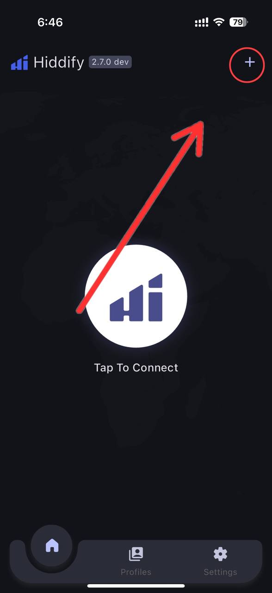
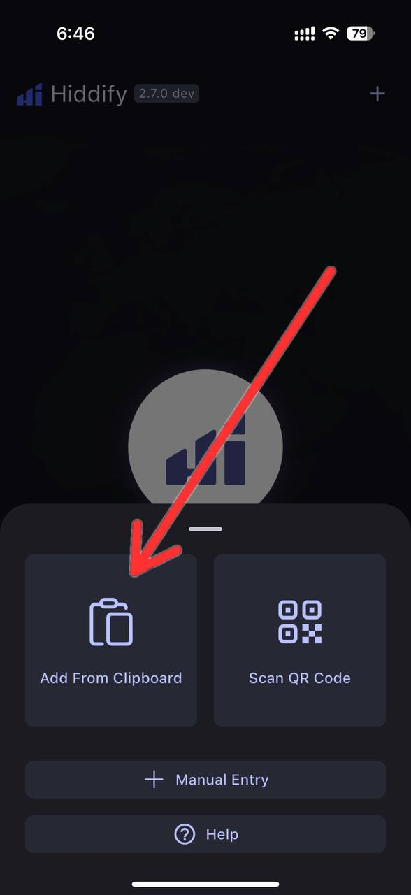
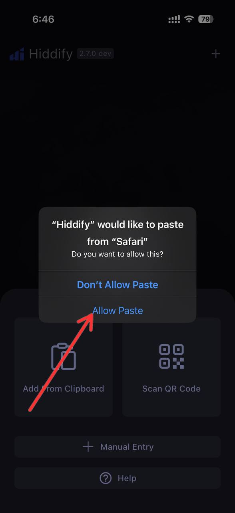
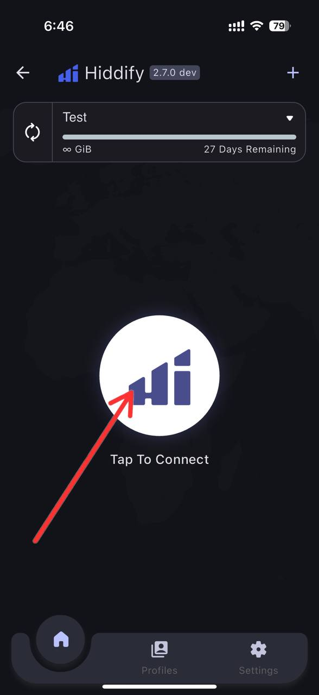
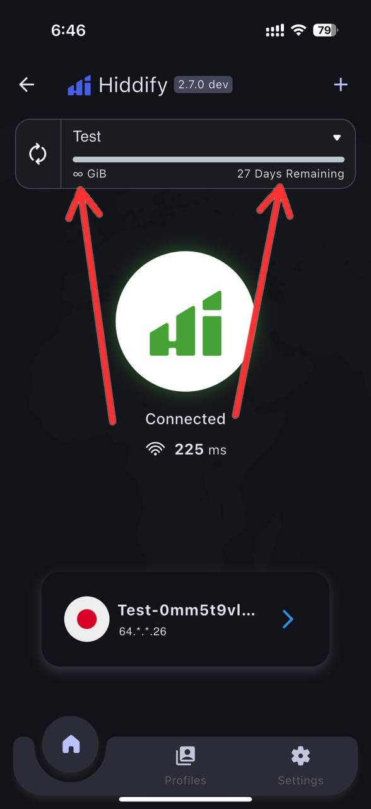
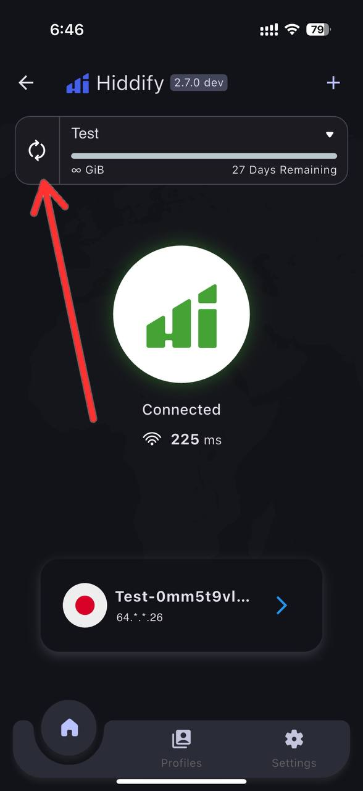
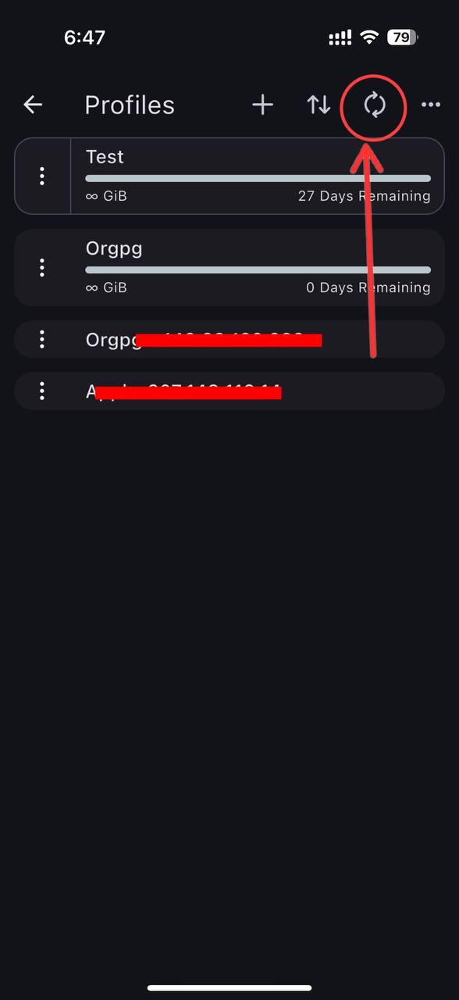
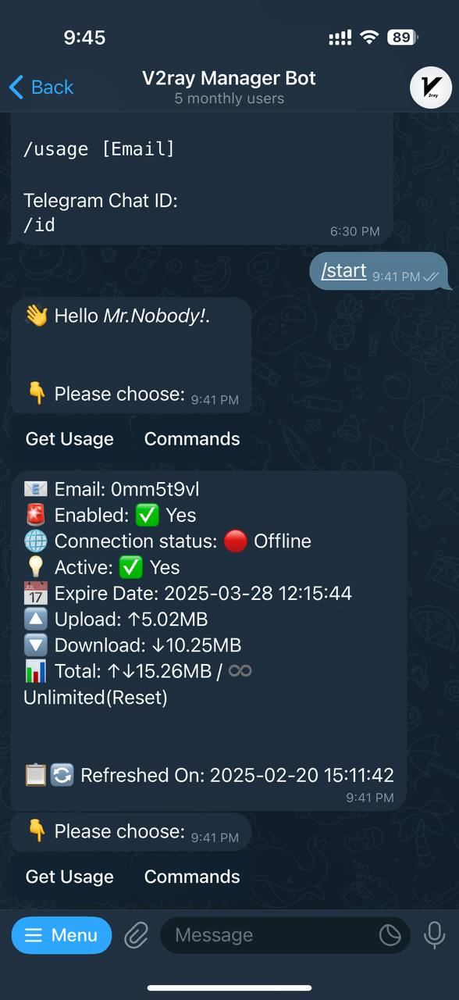

# Hiddify-Tutorial

Hiddify Vpn Key ဖြင့်သုံးပုံလမ်းညွှန်

## Step 1 :
"+" ကိုနှိပ်ပါ။

  

## Step 2 :
Add From Clipboard ကိုနိပ့်ပါ။

  

## Step 3 :
"Allow Paste" ကိုနှိပ်ပါ။

  

## Step 4 :
Tap to Connect ဖြင့်ချိတ်ဆက်အသုံးပြုနိုင်ပါသည်။

  

## Step 5 :
Ulimited Gb & ဝယ်ယူထားသည့် Subscription Expire Date ။

  

## Step 6 :
Subscription > Scan & Update

  

## Step 7 :
Subscription > Scan & Update

  

## Telegram Bot :
ဝယ်ယူထားသည့် Subscription Key Usage များကို Telegram Bot နှင့်စစ်ဆေးလိုပါက Admin ဆီ မိမိ ID ပို့ပေးရန်လိုအပ်ပါသည်။

  

  
  &nbsp;&nbsp;
  

